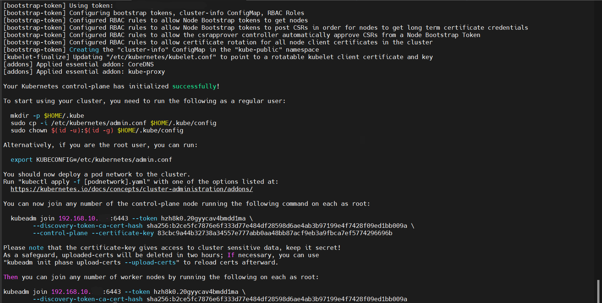
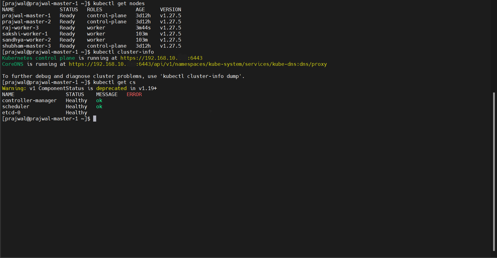

# Set up a Highly Available Baremetal Kubernetes Cluster using kubeadm

Follow this documentation to set up a highly-available multi-master Kubernetes cluster using __CentOS Linux 7__ VMs.

Refer official kubernetes document for latest updates to install cluster using [kubeadm](https://v1-27.docs.kubernetes.io/docs/setup/production-environment/tools/kubeadm/install-kubeadm/).

This documentation guides you in setting up a cluster with __3 Master__ nodes, __3 Worker__ nodes and a __load balancer__ node using HAProxy.

## VM Details

|Role|FQDN|IP|OS|RAM|CPU|
|----|----|----|----|----|----|
|Load Balancer|haproxy-lb.example.com|192.168.10.7|CentOS Linux 7|4G|1|
|Master|k8s-master-1.example.com|192.168.10.1|CentOS Linux 7|16G|2|
|Master|k8s-master-2.example.com|192.168.10.2|CentOS Linux 7|8G|2|
|Master|k8s-master-3.example.com|192.168.10.3|CentOS Linux 7|8G|2|
|Worker|k8s-worker-1.example.com|192.168.10.4|CentOS Linux 7|8G|2|
|Worker|k8s-worker-2.example.com|192.168.10.5|CentOS Linux 7|8G|2|
|Worker|k8s-worker-3.example.com|192.168.10.6|CentOS Linux 7|8G|2|

> __NOTE__: Perform all the commands as __"root"__ user unless otherwise specified

## Pre-requisites

- A compatible Linux host. The official k8s site provides generic instructions for Linux distributions based on __Debian__ and __Red Hat__ (CentOS/RHEL), and those distributions without a package manager.

- __2 GB__ or more of __RAM__ and __2 CPUs__ or more per machine. (except load balancer)

- __Host machine__ has atleast __2 cores__ and __16GB memory__ in this use case. Each machine has __50 GB storage__.

- __Full network connectivity__ between all machines in the cluster (public or private network is fine).

- __Unique hostname, MAC address, and product_uuid__ for every node :-
  - You can get the __MAC address__ of the network interfaces using the command :

    ```
    ip link
    ``` 

    or 
    
    ```
    ifconfig -a
    ```

  - To check the __product_uuid__ : 

    ```
    cat /sys/class/dmi/id/product_uuid
    ```

#### Set __hostnames__ of each node :-

```
hostnamectl set-hostname '<node_hostname>'
```

__Example__ : `hostnamectl set-hostname 'k8s-master-1'`

    To reflect changes start a new shell session / log out and log back in :

```
bash
``` 

#### Configure __/etc/hosts__ file :
  
    To manage local DNS resolution and allow the nodes in the cluster to communicate with each other using hostnames.

```
nano /etc/hosts
```

    Make changes as per your __IPs__ and __hostnames__, and add the below lines in the __hosts__ file of each node : 

```
192.168.10.1 k8s-master-1
192.168.10.2 k8s-master-2
192.168.10.3 k8s-master-3
192.168.10.4 k8s-worker-1
192.168.10.5 k8s-worker-2
192.168.10.6 k8s-worker-3
192.168.10.7 haproxy-lb
```

> __NOTE__: Kubernetes uses these values to uniquely identify the nodes in the cluster. If these values are not unique to each node, the installation process may fail.

#### Set __UTC__ (or preferred timezone) with same time on all nodes :-

  - __Check__ timezone : 

    ```
    timedatectl
    ```
  
  - __List__ timezones : 
  
    ```
    timedatectl list-timezones
    ```
  
  - __Set__ the timezone (UTC or timezone of your preference) : 
  
    ```
    timedatectl set-timezone UTC
    ``` 
  
  - Restart __chronyd__ service : 
  
    ```
    systemctl restart chronyd
    ```
  
    If still the time is not synced on all nodes run the below commands :-
    
    - Disable NTP time sync : 

        ```
        systemctl disable --now chronyd
        ```    

    - Set time manually : 
    
        ```
        timedatectl set-time HH:MM:SS
        ```

> __NOTE__: If the time on all nodes is not synced, it may lead to __pod scheduling problems, certificate validity issues, desynchronization of cluster-wide operations__, etc. 

#### Open required __ports__ on your machines :-

- __Control Plane(s)__ :

    |Protocol|Direction|Port Range|Purpose|Used By|
    |----|----|----|----|----|
    |TCP|Inbound|6443|Kubernetes API server|All|
    |TCP|Inbound|2379 - 2380|etcd server client API|kube-apiserver, etcd|
    |TCP|Inbound|10250|Kubelet API|Self, Control plane|
    |TCP|Inbound|10259|kube-scheduler|Self|
    |TCP|Inbound|10257|kube-controller-manager|Self|
    |TCP|Inbound|22|SSH connection|-|
    |UDP|-|8472|Cluster-wide network communication - Flannel VXLAN|-|

- __Load Balancer__ : 

    Uses the same ports as control planes.

- __Worker Node(s)__ :

    |Protocol|Direction|Port Range|Purpose|Used By|
    |----|----|----|----|----|
    |TCP|Inbound|10250|Kubelet API|Self, Control plane|
    |TCP|Inbound|30000 - 32767|NodePort Services †|All|
    |TCP|Inbound|22|SSH connection|-|
    |UDP|-|8472|Cluster-wide network communication - Flannel VXLAN|-|

    - † - Default port range for NodePort Services.
    - All default port numbers can be overridden. 
  
- To __open__ the respective ports given above (__Master Nodes__) : 

    ```
    firewall-cmd --zone=public --add-port=6443/tcp,2379-2380/tcp,10250/tcp,10259/tcp,10257/tcp,22/tcp,8472/tcp --permanent
    ```

- To __open__ the respective ports given above (__Worker Nodes__) :
    
    ```
    firewall-cmd --zone=public --add-port=10250/tcp,30000–32767/tcp,22/tcp,8472/tcp --permanent
    ```

- __Reload/restart__ the __firewall__ service so the changes are reflected :
    
    ```
    firewall-cmd --reload
    ```
    
- You can use tools like __netcat__ to check if a port is open. For example : 
    ```
    nc 127.0.0.1 6443
    ```

    You can open only the above mentioned ports specifically if the machines are in a __public network__ to keep the cluster __secure__. If the nodes/machines are operating in a __private network__ then you can shutdown the firewall service instead of opening each port.

    - Check firewall __status__ : 
    
        ```
        firewall-cmd --state
        ```
    
    - __Stop__ firewall :

        ```
        systemctl stop firewalld
        ```
    
    - __Turn off__ firewall service across reboots : 
    
        ```
        systemctl disable firewalld
        ```

## Set up the Load Balancer 

#### Update packages : 

```
yum update
```

#### Install Haproxy : 

```
yum install -y haproxy
```

#### Configure Haproxy :

```
nano /etc/haproxy/haproxy.cfg
```

    Append below lines to __haproxy.cfg__ file -

```
frontend kubernetes-frontend
    bind lb_node_ip:6443
    mode tcp
    option tcplog
    default_backend kubernetes-backend

backend kubernetes-backend
    mode tcp
    option tcp-check
    balance roundrobin
    server master_node1_hostname master_node1_ip:6443 check fall 3 rise 2      
    server master_node2_hostname master_node2_ip:6443 check fall 3 rise 2
    server master_node3_hostname master_node3_ip:6443 check fall 3 rise 2
```
    __Example__ :

```
frontend kubernetes-frontend
    bind 192.168.10.7:6443
    mode tcp
    option tcplog
    default_backend kubernetes-backend

backend kubernetes-backend
    mode tcp
    option tcp-check
    balance roundrobin
    server k8s-master-1 192.168.10.1:6443 check fall 3 rise 2      
    server k8s-master-2 192.168.10.2:6443 check fall 3 rise 2
    server k8s-master-3 192.168.10.3:6443 check fall 3 rise 2
```

#### Restart haproxy service :

```
systemctl restart haproxy
```

## Setting up all the k8s nodes (3 Masters and 3 Workers)

Run the below mentioned commands on all the nodes to prepare them to initialize the kubernetes cluster.

#### Disable __Swap__ memory :- 
  
You MUST disable swap in order for the kubelet to work properly.

- Disable swapping __temporarily__ : 

    ```
    swapoff -a
    ```

- To make this change __persistent__ across reboots : 

    ```
    sed -i '/swap/d' /etc/fstab
    ```

#### Configure __SELinux__ :-

- Temporarily set the SELinux mode to __"Permissive"__ :
    
    In this mode, you can monitor policy violations without enforcing them.

    ```
    setenforce 0
    ```

- Make this change __persistent__ across system reboots :

    ```
    sed -i 's/^SELINUX=enforcing$/SELINUX=permissive/' /etc/selinux/config
    ```

#### Install latest stable __docker__ version :- 

- [Uninstall older Docker Engine version.](https://docs.docker.com/engine/install/centos/#uninstall-docker-engine)
    
    - Incase you receive an error -  `"No package found"`; during `yum remove docker *` command, execute : 
    
        ```
        yum remove docker-ce docker-ce-cli containerd.io
        ``` 

- [Docker installation on CentOS](https://docs.docker.com/engine/install/centos/).
    
    - If you get an __error__ during ```yum install docker ...```, then execute below commands and continue installation :
       
        ```
        yum remove docker-1.13.1-209.git7d71120.el7.centos.x86_64
        yum clean all
        yum update
        ```

- __Start__ docker service :
    
    ```
    systemctl start docker
    ```

- __Enable__ the docker service to start automatically at boot time using systemd as the init system :

    ```
    systemctl enable docker
    ```

- __Verify installation__ : 

    ```
    docker ps -a
    ```

- [Post installation steps to run docker as a non-root user.](https://docs.docker.com/engine/install/linux-postinstall/#manage-docker-as-a-non-root-user)
    
    Even after following above steps you receive __docker.sock__ permission error, execute below commands as __non-root__ user: 
    
    - Check the user is a member of grp __"docker"__ :
        
        ```
        groups $USER
        ```
    
    - __Restart__ docker :
       
        ```
        sudo systemctl restart docker
        ```
    
    - __Verify__ docker.sock perms :
    
        ```
        ls -l /var/run/docker.sock
        ```

        It should show the owner as __'root'__ and the group as __'docker'__. (If the group is 'root', then we need to execute the below command:

        - __Change__ group ownership :
            
            ```
            sudo chown root:docker /var/run/docker.sock
            bash
            ```

#### [Install and configure __Container Runtime__]((https://kubernetes.io/docs/setup/production-environment/container-runtimes/)) :-
  
A container runtime is a software component responsible for executing and managing containers on a host system. The Container Runtime must be configured to load the CNI plugins required to implement the Kubernetes network model.

- Pre-requisites :
    
    - Configure __kernel modules__ : 
      
      ```
      cat <<EOF | sudo tee /etc/modules-load.d/k8s.conf
      overlay
      br_netfilter
      EOF
      ```

    - __Load__ the kernel modules : 
      
      ```
      sudo modprobe overlay
      sudo modprobe br_netfilter
      ```

    - Verify the modules are loaded : 
      
      ```
      lsmod | grep br_netfilter
      lsmod | grep overlay
      ```

    - Configure __sysctl parameters__ :
      
      > Essential for networking and IP forwarding configurations
      
      ```
      cat <<EOF | sudo tee /etc/sysctl.d/k8s.conf
      net.bridge.bridge-nf-call-iptables  = 1
      net.bridge.bridge-nf-call-ip6tables = 1
      net.ipv4.ip_forward                 = 1
      EOF
      ```

    - __Apply__ sysctl params without reboot : 
      
      ```
      sudo sysctl --system
      ```

    - __Verify__ the sysctl config : 
     
      ```
      sysctl net.bridge.bridge-nf-call-iptables net.bridge.bridge-nf-call-ip6tables net.ipv4.ip_forward
      ```

- [Install __containerd__](https://github.com/containerd/containerd/blob/main/docs/getting-started.md) : 

    - Step 1 : Install __containerd__

        > Already installed during docker installation.

    - Step 2 : Install __runc__ 

        > The containerd.io package distributed by docker contains runc, but does not contain CNI plugins.

    - Step 3 : Install __CNI plugins__

        - Download the __"cni-plugins-<OS>-<ARCH>-<VERSION>.tgz"__ archive from [CNI-Plugins repo](https://github.com/containernetworking/plugins/releases) - 
            
            ```
            wget https://<link_to_cni_plugin_version>.tgz
            ```
            
            For example, here I used "cni-plugins-linux-amd64-v1.4.0" :

            ```
            wget https://github.com/containernetworking/plugins/releases/download/v1.4.0/cni-plugins-linux-amd64-v1.4.0.tgz
            ```
        
      - Extract it under __/opt/cni/bin__:
        
        ```
        mkdir -p /opt/cni/bin
        sudo tar Cxzvf /opt/cni/bin cni_plugin_version.tgz
        ```

- Configure containerd to use __systemd__ as cgroup driver :- 

    On Linux, __control groups__ (cgroups) are used to __constrain resources__ that are allocated to processes.
    
    Both the __kubelet__ and the underlying __container runtime__ need to interface with control groups to enforce __resource management__ for pods and containers. To __interface__ with control groups, the kubelet and the container runtime need to use a __cgroup driver__.
    
    There are two cgroup drivers available : `1. cgroupfs`  `2. systemd`
    
    __"systemd"__ cgroup driver is recommended for __kubeadm__ based setups instead of the __kubelet's default cgroupfs__ driver, because kubeadm manages the kubelet as a systemd service.
    
    To use the systemd cgroup driver with runc, you need to make changes in the containerd __config__ file : 

    - __Generate__ a default containerd config file :

        ```
        containerd config default > /etc/containerd/config.toml
        ```
        
    - __Edit__ the config file : 

        ```
        nano /etc/containerd/config.toml
        ```

    - __Search__ for the following properties in the file : 

        ```
        [plugins."io.containerd.grpc.v1.cri".containerd.runtimes.runc] 
          ...
            [plugins."io.containerd.grpc.v1.cri".containerd.runtimes.runc.options]
        ```

        In this property, __set__ : 

        ```
        SystemdCgroup = true
        ```

    - To prevent inconsistent __sandboximage__ warning, search below property :

        ```
        [plugins."io.containerd.grpc.v1.cri"]
        ```

        - __Set__ : 

            ```
            sandbox_image = "registry.k8s.io/pause:3.9"
            ```

    - __Restart__ containerd service :
      
      ```
      systemctl restart containerd
      ```

#### Install __kubeadm, kubelet, kubectl___ :-

__kubeadm__ : the command to bootstrap the cluster.

__kubelet__ : the component that runs on all of the machines in your cluster and does things like starting pods and containers.

__kubectl__: the command line util to talk to your cluster.

- Create a __YUM repository configuration file__ for the Kubernetes packages : 

    ```
    cat <<EOF | sudo tee /etc/yum.repos.d/kubernetes.repo
    [kubernetes]
    name=Kubernetes
    baseurl=https://packages.cloud.google.com/yum/repos/kubernetes-el7-\$basearch
    enabled=1
    gpgcheck=1
    repo_gpgcheck=1
    gpgkey=https://packages.cloud.google.com/yum/doc/yum-key.gpg https://packages.cloud.google.com/yum/doc/rpm-package-key.gpg
    exclude=kubelet kubeadm kubectl
    EOF
    ```

- __Update__ installed packages : 

    ```
    yum update 
    ```

- Install __latest__ Kubernetes components version :

    ```
    yum install -y kubelet kubeadm kubectl --disableexcludes=kubernetes
    ```

    - To install __specific__ version of k8s components : 

      ```
      yum install -y kubelet-<maj>.<min> kubeadm-<maj>.<min> kubectl-<maj>.<min> --disableexcludes=kubernetes
      ``` 

      Where __maj__ = major version and __min__ = minor version

      For example, I have used : 

      ```
      yum install -y kubelet-1.27.5 kubeadm-1.27.5 kubectl-1.27.5 --disableexcludes=kubernetes
      ```

- __Enable__ and set kubectl to automatically __start__ at boot time :

    ```
    systemctl enable --now kubelet
    ```

## Initialize the Kubernetes Cluster

Select any 1 machine (__k8s-master-1__) as the __Main Master__ node (one with higher specs) and execute the below commands to initialize the cluster.

- Initialize a Kubernetes __control plane__ on the master node, configure the control plane __endpoint__, upload certificates, set the API server advertise address, and specify the pod network CIDR for the cluster :

    ```
    sudo kubeadm init --control-plane-endpoint="<lb_ip>:6443" --upload-certs --apiserver-advertise-address=<main_master_ip> --pod-network-cidr=10.244.0.0/16
    ```

  where __<lb_ip>__ = load balancer node ip and __<main_master_ip>__ = main master node ip.

    > __NOTE__: There are various types of pod networks available for kubernetes, but here I have used __Flannel__ pod network whose CIDR = __10.244.0.0/16__

    If you receive an error listed below execute the respective commands and again run the kubeadm init command.
    
    - Port or __firewall__ error :

      ```
      systemctl stop firewalld
      systemctl disable firewalld
      ```

    - __Port__ in use error : 

      ```
      lsof -i :<port>
      sudo kill <PID>
      ```

- __Output__ after successful initialization of the cluster control-plane : 

    

    <!-- <div align="center">
      
    </div> -->

  > __IMPORTANT__ : As you can see in the above image, there are __two join__ commands - one for __control-plane__ nodes and the other for __worker__ nodes. __Copy__ these commands somewhere as you will use these commands to join the respective nodes to the cluster later on.  

- The output will show some commands to be executed as a __regular user__ : 
    
    ```
    mkdir -p $HOME/.kube
    sudo cp -i /etc/kubernetes/admin.conf $HOME/.kube/config
    sudo chown $(id -u):$(id -g) $HOME/.kube/config
    ```

    Now switch to sudo user and set the env variable : 

    ```
    sudo -i
    export KUBECONFIG=/etc/kubernetes/admin.conf
    ```

## Install pod network on the cluster : 

In this project, I am using the __Flannel__ Pod Networking.  

- __Install__ Flannel on the cluster :
    
    ```
    kubectl apply -f https://github.com/flannel-io/flannel/releases/latest/download/kube-flannel.yml
    ```

> __NOTE__: If the command doesn't work check this link - `https://github.com/flannel-io/flannel`; or search for Flannel's github repo and copy link of __kube-flannel.yml__ and replace the link in above command.

- __Restart__ kubelet : 

    ```
    systemctl restart kubelet
    ```

- Check __status__ of kubelet for any errors : 

    ```
    systemctl status kubelet
    ```

- Check if the master node's status is __"Ready"__ : 

  ```
  kubectl get nodes 
  ```

  __Output__ : 

  ```
  NAME            STATUS   ROLES           AGE     VERSION
  k8s-master-1    Ready    control-plane   1d22h   v1.27.5
  ```

## Join remaining nodes to the cluster (2 Masters & 3  Workers)

Use the __`kubeadm join ...`__ commands you copied earlier from the output of __`kubeadm init ...`__ command.

> __NOTE__: You also need to mention "__--apiserver-advertise-address__" in the join command when you join the other master nodes.

#### Join Master nodes (__k8s-master-2__ and __k8s-master-3__)  : 
    
Run the join command of Master nodes on both, "k8s-master-2" and "k8s-master-3", nodes.

__Example__ : 

```
sudo kubeadm join <lb_ip>:6443 --token sample_token --discovery-token-ca-cert-hash sha256:sample_hash --control-plane --certificate-key sample_cert_key --apiserver-advertise-address <master_node_ip>
```

    where __<lb_ip>__ = load balancer ip and replace __<master_node_ip>__ = respective master node ip on which the command is being executed.

#### Join worker nodes (__k8s-worker-1, k8s-worker-2, k8s-worker-3__): 

Run the join command of worker nodes on all the remaining nodes. 

__Example__ :

```
sudo kubeadm join <lb_ip>:6443 --token sample_token --discovery-token-ca-cert-hash sha256:sample_hash
```

    where __<lb_ip>__ = load balancer node ip

> __NOTE__: The tokens and certificate keys of the join command __expire__ after 2 hours. Rendering the join commands you copied earlier invalid. 

#### __New join command__ (worker nodes)

Run the below commands on Main Master :

```
sudo kubeadm token create --print-join-command
```

__Output__ :

```
kubeadm join 192.168.10.7:6443 --token 2050ew.1nyb3p4lybbdyory --discovery-token-ca-cert-hash sha256:fcc6b2521ca2abec1522ba529a76f2cb24eea78e9511aee88f4237945c766a33
```

    This command can directly be used to join the worker nodes. But to join the master nodes you need to add the certificate key in this command.
  
#### Create new __certificate key__ to join master nodes :

```
sudo kubeadm init phase upload-certs --upload-certs
```

__Output__ :

```
[upload-certs] Storing the certificates in Secret "kubeadm-certs" in the "kube-system" Namespace
[upload-certs] Using certificate key:
3f4d27d1eefadbdf736b52053c76d60893dc42a1ba7c06d06df0eb47a88418b1
```

#### New join command (__Master nodes__):

Combine the new worker join command and the __certificate key__. Also, pass the "__--apiserver-advertise-address__" to create a new join command for the master nodes :

```
sudo kubeadm join 192.168.10.7:6443 --token 2050ew.1nyb3p4lybbdyory --discovery-token-ca-cert-hash sha256:fcc6b2521ca2abec1522ba529a76f2cb24eea78e9511aee88f4237945c766a33 --control-plane --certificate-key 3f4d27d1eefadbdf736b52053c76d60893dc42a1ba7c06d06df0eb47a88418b1 --apiserver-advertise-address <node_ip>
```

    You can use the above command to join Master nodes to the cluster even if the initial join commands get expired.

## Verify the cluster

#### Check cluster __Nodes'__ status : 

  ```
  kubectl get nodes 
  ```

__Output__ :

```
    NAME           STATUS   ROLES           AGE     VERSION
    k8s-master-1   Ready    control-plane   2d9h    v1.27.5
    k8s-master-2   Ready    control-plane   2d8h    v1.27.5
    k8s-master-3   Ready    control-plane   2d8h    v1.27.5
    k8s-worker-1   Ready    <none>          1d22h   v1.27.5
    k8s-worker-2   Ready    <none>          1d22h   v1.27.5
    k8s-worker-3   Ready    <none>          1d20h   v1.27.5
```

- If you receive an __error__ "`couldn't get current server API group list`", execute :
    
    ```
    kubectl get nodes --insecure-skip-tls-verify --username=<your-vm-username> --password=<your-vm-password>
    ```

#### Get __cluster information__ :
  
  ```
  kubectl cluster-info
  ```

__Output__ :

```
Kubernetes control plane is running at https://192.168.10.7:6443
CoreDNS is running at https://192.168.10.7:6443/api/v1/namespaces/kube-system/services/kube-dns:dns/proxy
```

#### Retrieve __health__ and __status__ of control plane components :
  
  ```
  kubectl get cs 
  ```

__Output__ : 

```
Warning: v1 ComponentStatus is deprecated in v1.19+
NAME                 STATUS    MESSAGE   ERROR
scheduler            Healthy   ok
controller-manager   Healthy   ok
etcd-0               Healthy
```


<!-- <div align="center">
  
</div> -->

## Specify __roles__ for worker nodes :

As you can see in the output of "__kubectl get nodes__" commands, the worker nodes are not labelled. To label them with roles :

  ```
  kubectl label node <node-name> node-role.kubernetes.io/worker=worker
  ```

__Output__ : 

```
    NAME           STATUS   ROLES           AGE     VERSION
    k8s-master-1   Ready    control-plane   2d9h    v1.27.5
    k8s-master-2   Ready    control-plane   2d8h    v1.27.5
    k8s-master-3   Ready    control-plane   2d8h    v1.27.5
    k8s-worker-1   Ready    worker          1d22h   v1.27.5
    k8s-worker-2   Ready    worker          1d22h   v1.27.5
    k8s-worker-3   Ready    worker          1d20h   v1.27.5
```

## __Congratulations__

You have set up a Baremetal HA Multi-Master Kubernetes Cluster using Kubeadm.

Now you can deploy a [sample deployment](https://github.com/PrajwalP7295/Kubernetes-Baremetal-Cluster-setup-using-Kubeadm-HA-Masters/tree/main/sample-deployment) on the cluster to test its working.

Furthermore, you can integrate [MetalLB](https://github.com/PrajwalP7295/Kubernetes-Baremetal-Cluster-setup-using-Kubeadm-HA-Masters/tree/main/metal-lb) and [Ingress-Controller](https://github.com/PrajwalP7295/Kubernetes-Baremetal-Cluster-setup-using-Kubeadm-HA-Masters/tree/main/ingress-nginx-controller) on this cluster for enhanced load balancing and routing capabilities for the services you create to expose to the clients.

Have Fun!!