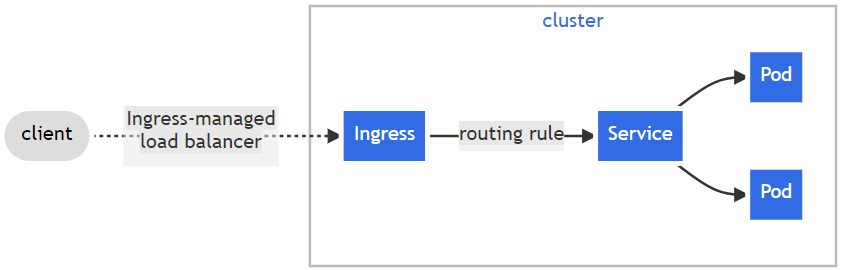

# Set up Ingress-nginx Controller on the kubernetes cluster

__ingress-nginx__ is an Ingress controller for Kubernetes using __NGINX__ as a reverse proxy and load balancer.

## What is an Ingress ?

An __API object__ that manages external access to the services in a cluster, typically HTTP. 

Ingress __exposes__ HTTP and HTTPS routes from outside the cluster to services within the cluster. __Traffic routing__ is controlled by rules defined on the Ingress resource.

It may be configured to give Services externally-reachable URLs, load balance traffic, terminate SSL / TLS, and offer name-based virtual hosting.

<div align="center">
  
</div>

## Prerequisites 

- You must have an Ingress controller to satisfy an Ingress. Only creating an Ingress resource has no effect.

- You may need to deploy an Ingress controller such as [ingress-nginx](https://kubernetes.github.io/ingress-nginx/deploy/#bare-metal-clusters). You can choose from a number of [Ingress controllers](https://kubernetes.io/docs/concepts/services-networking/ingress-controllers/).

- Ideally, all Ingress controllers should fit the [reference specification](https://github.com/kubernetes/ingress-nginx/blob/main/README.md#supported-versions-table). 

## Generate or use existing [SSL certificates](https://www.baeldung.com/openssl-self-signed-cert)

- __STEP 1__ : Create the server __private key__

  ```
  openssl genrsa -out cert.key 2048
  ``` 
  - Output :
    ```
    Enter pass phrase for cert.key :
    ```
    You can enter some phrase or let it be empty.

- STEP 2: Create the certificate signing request (__CSR__)
  ```
  openssl req -new -key cert.key -out cert.csr
  ```
  - Output : 
    ```
    Enter pass phrase for cert.key:
    You are about to be asked to enter information that will be incorporated
    into your certificate request.
    What you are about to enter is what is called a Distinguished Name or a DN.
    There are quite a few fields but you can leave some blank
    For some fields there will be a default value,
    If you enter '.', the field will be left blank.
    -----
    Country Name (2 letter code) [AU]:
    State or Province Name (full name) [Some-State]:                       
    Locality Name (eg, city) []:
    Organization Name (eg, company) [Internet Widgits Pty Ltd]:
    Organizational Unit Name (eg, section) []:
    Common Name (e.g. server FQDN or YOUR name) []:
    Email Address []:

    Please enter the following 'extra' attributes
    to be sent with your certificate request
    A challenge password []:
    An optional company name []:
    ```

    An important field is “Common Name,” which should be the exact Fully Qualified Domain Name (FQDN) of our domain

- STEP 3: Sign the __certificate__ using the private key and CSR
  ```
  openssl x509 -req -days 3650 -in cert.csr -signkey cert.key -out cert.crt
  ```

- The above 3 steps will create files, namely : ```cert.crt```, ```cert.csr``` and ```cert.key```

## Install [ingress-nginx]() controller 

```
kubectl apply -f https://raw.githubusercontent.com/kubernetes/ingress-nginx/controller-v1.8.2/deploy/static/provider/baremetal/deploy.yaml
```
- __Verify__ installation :
  ```
  kubectl get pods -n ingress-nginx -l app.kubernetes.io/name=ingress-nginx --watch
  ```
- Check ingress controller __version__ :
  ```
  POD_NAMESPACE=ingress-nginx
  POD_NAME=$(kubectl get pods -n $POD_NAMESPACE -l app.kubernetes.io/name=ingress-nginx --field-selector=status.phase=Running -o name)
  kubectl exec $POD_NAME -n $POD_NAMESPACE -- /nginx-ingress-controller --version
  ```

## Configure ingress-nginx Controller 

The ingress-controller service should be of type = __LoadBalancer__.

But after the resource creation from the manifest file applied in install stage, we see that the service created is of type = __NodePort__.

Hence we need to __edit__ the ingress-controller service :
```
kubectl edit svc ingress-nginx-controller -n ingress-nginx
```
Set : 
```
.
spec: 
  .
  type: LoadBalancer
  .
```

Check the ingress-nginx-controller service : 
```
kubectl get svc -n ingress-nginx
```
  - Output : 
    ```
    Namespace        Name                                 Type           Cluster-IP       External-IP      Port(s) 
    ingress-nginx    ingress-nginx-controller             LoadBalancer   10.105.12.252    192.168.10.*   80:30700/TCP,443:32278/TCP
    ```
    Here the __EXTERNAL-IP__ allocated will be from the __IP address pool__ configured during MetalLB setup.
